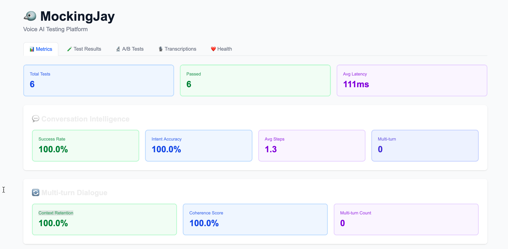

# MockingJay 🐦

**A testing harness for voice AI agents.**

MockingJay is not a voice AI agent — it's the tool you use to test one. It sends scripted conversations to your agent, validates responses using LLM-based intent classification, records real calls, transcribes audio, and surfaces metrics in a dashboard.

[](https://opensource.org/licenses/MIT)
[](https://go.dev/)




---

## What MockingJay Does

Your voice AI agent lives separately — it could be a GPT-powered phone bot, an IVR system, a Twilio-based assistant, or any HTTP endpoint that accepts text and returns a response. MockingJay plugs into it and tests it:

| Command | What it does |
|---|---|
| `mockingjay run` | Sends scripted multi-turn conversations to your agent's HTTP endpoint. Uses LLM-based intent classification to validate responses, measures latency, detects failure points, scores response quality. |
| `mockingjay ab` | Runs the same scenarios against two agent variants side-by-side and declares a winner based on latency, pass rate, and task completion. |
| `mockingjay call` | Makes a real outbound phone call via Twilio to your deployed agent. Records the call. |
| `mockingjay calltest` | Chains call → transcribe → validate → report in one command. Uses LLM classification to validate the transcript against expected intent. |
| `mockingjay transcribe` | Converts a call recording (local file or URL) to text using Deepgram ASR. Saves the transcript to the dashboard. |
| `mockingjay monitor` | Runs test scenarios on a schedule and alerts when pass rate drops below a threshold. |
| Dashboard | Aggregates all results — pass rates, latency, intent accuracy, A/B comparisons, transcriptions, health status — in a visual UI. |

---

## How It Works

MockingJay sends each scenario step's text to your agent's HTTP endpoint and receives a text response back. It then uses an LLM to classify whether the agent's response matches the expected intent — no changes to your agent required.

```
MockingJay sends:    { "text": "Hello" }
Your agent responds: { "text": "Hi! How can I help you today?", "success": true }
LLM classifies:      intent = "greeting", confidence = 98%
MockingJay checks:   does "greeting" match expected "greeting"? ✓ PASS
```

Your agent only needs to return a `text` field. The `intent` field is optional — if an LLM provider is configured, MockingJay infers intent from the response text automatically.

### Supported LLM Providers

MockingJay works with any of these LLM backends for intent classification and quality scoring:

| Provider | Set these env vars | Model used |
|---|---|---|
| **OpenAI** (default) | `OPENAI_API_KEY` | GPT-4o-mini |
| **Anthropic** | `LLM_PROVIDER=anthropic`, `ANTHROPIC_API_KEY` | Claude Haiku |
| **Ollama** (local) | `LLM_PROVIDER=ollama`, optionally `OLLAMA_MODEL`, `OLLAMA_HOST` | llama3 (default) |

If no LLM is configured, MockingJay falls back to comparing the `intent` field in your agent's response directly.

---

## How It Fits Into Your Workflow

```
1. Develop your voice AI agent
2. Write test scenarios in mockingjay.yaml
3. Run mockingjay run on every deploy (in CI or locally)
4. Use mockingjay calltest to test the full phone experience end-to-end
5. Use mockingjay ab to compare agent versions before promoting
6. Use mockingjay monitor to track quality in production
```

The `examples/voice-server` in this repo is a minimal stand-in agent for local testing. It also includes a `/call-bad` endpoint that intentionally returns wrong responses — useful for demonstrating MockingJay catching real failures.

### Testing call quality end-to-end

`mockingjay call` only tells you whether the call connected and completed — not whether your agent said the right thing. Use `mockingjay calltest` to validate the full loop automatically:

```bash
mockingjay calltest \
  --to +15559876543 \
  --webhook https://your-agent.com/voice \
  --expect "greeting" \
  --api-url http://localhost:8080
```

This makes the call, transcribes the recording via Deepgram, uses the LLM to validate the transcript matches the expected intent, and saves the result to the dashboard — all in one command.

---

## Quick Start

### 1. Clone and Build
```bash
git clone https://github.com/ashczar77/mockingjay.git
cd mockingjay/cli
go build -o mockingjay
```

### 2. Start the Example Voice Server (stand-in agent for local testing)
```bash
cd examples/voice-server
go run main.go
# Starts on http://localhost:9000
# /call      — well-behaved agent (always correct)
# /call-bad  — broken agent (always wrong, for demo purposes)
```

### 3. Run Test Scenarios
```bash
cd examples/voice-server
../../cli/mockingjay run
```

### 4. View Dashboard (Optional)
```bash
# Terminal 1: backend
cd cloud/backend && go run main.go

# Terminal 2: frontend
cd cloud/frontend && npm install && npm run dev

# Open http://localhost:3000
```

---

## Commands

### `mockingjay run` — Validate agent responses

Sends each scenario's conversation steps to your agent's HTTP endpoint. Uses LLM-based intent classification (when `OPENAI_API_KEY` is set) to determine whether the agent's text response matches the expected intent.

```bash
mockingjay run                          # uses mockingjay.yaml
mockingjay run -c my-config.yaml        # custom config
mockingjay run -s basic-greeting        # single scenario
mockingjay run --api-url http://localhost:8080  # report results to dashboard
```

What it measures:
- **Intent accuracy** — does the agent's response match the expected intent? (LLM-classified)
- **Latency** — how long did each response take?
- **Task completion** — did the full conversation flow succeed?
- **Failure points** — which steps consistently fail across runs?
- **Response quality** — completeness, sentiment, confidence (LLM-evaluated)
- **Context retention** — does the agent maintain context across multi-turn conversations?
- **Confusion patterns** — which inputs cause the agent to misfire?

### `mockingjay ab` — Compare two agent variants

```bash
mockingjay ab -c ab-test.yaml
```

Config:
```yaml
version: 1

ab_test:
  variant_a:
    name: "v1-baseline"
    endpoint: "http://localhost:9000/call"
  variant_b:
    name: "v2-new-model"
    endpoint: "http://localhost:9001/call"

scenarios:
  - name: "basic-greeting"
    steps:
      - say: "Hello"
        expect: "greeting"
```

Output:
```
🔬 A/B Test: v1-baseline vs v2-new-model

  Metric                    v1-baseline  v2-new-model        Delta
  ------                       --------      --------        -----
  Avg Latency (ms)              105.0         89.0  ✓       -16.0
  P95 Latency (ms)              108.0         92.0  ✓       -16.0
  Pass Rate (%)                 100.0        100.0            +0.0
  Task Completion (%)           100.0        100.0            +0.0

  🏆 Winner: v2-new-model
```

### `mockingjay call` — Test the real phone experience

Makes an outbound call via Twilio to your deployed agent. The `--webhook` URL is your agent's TwiML endpoint — Twilio fetches it to get instructions for what to say/do during the call.

```bash
export TWILIO_ACCOUNT_SID=ACxxx
export TWILIO_AUTH_TOKEN=xxx
export TWILIO_FROM_NUMBER=+15551234567

mockingjay call \
  --to +15559876543 \
  --webhook https://your-agent.com/voice \
  --record
```

> **Note:** Twilio trial accounts can only call verified numbers and prepend a trial message. Upgrade your Twilio account to remove these restrictions.

### `mockingjay calltest` — Automated call quality loop

Chains call → transcribe → validate → report in a single command. Uses LLM classification to validate the transcript against the expected intent — not just a string search.

Requires `TWILIO_ACCOUNT_SID`, `TWILIO_AUTH_TOKEN`, `TWILIO_FROM_NUMBER`, `DEEPGRAM_API_KEY`, and `OPENAI_API_KEY`.

```bash
mockingjay calltest \
  --to +15559876543 \
  --webhook https://your-agent.com/voice \
  --expect "greeting" \
  --api-url http://localhost:8080
```

- `--expect` — the intent the transcript should express (validated by LLM)
- `--api-url` — saves the transcription and pass/fail result to the dashboard

### `mockingjay monitor` — Production monitoring

Runs your test scenarios on a schedule and alerts when pass rate drops below a threshold.

```bash
mockingjay monitor \
  --interval 300 \
  --threshold 90 \
  --alert-webhook https://hooks.slack.com/xxx \
  --api-url http://localhost:8080
```

- `--interval` — seconds between runs (default: 60)
- `--threshold` — pass rate % below which an alert fires (default: 80)
- `--alert-webhook` — Slack or any webhook URL to POST alerts to
- `--api-url` — reports each run to the dashboard

### `mockingjay transcribe` — Convert recordings to text

Takes a call recording and returns a transcript with confidence score and duration. Use `--api-url` to save it to the dashboard.

```bash
export DEEPGRAM_API_KEY=xxx

# From local file
mockingjay transcribe --file recording.wav --api-url http://localhost:8080

# From URL (e.g. Twilio recording)
mockingjay transcribe --url https://api.twilio.com/recordings/xxx.mp3
```

---

## Configuration Reference

```yaml
version: 1

agent:
  endpoint: "http://localhost:9000/call"  # your agent's HTTP endpoint

scenarios:
  - name: "basic-greeting"
    description: "Test basic greeting flow"
    steps:
      - say: "Hello"
        expect: "greeting"

  - name: "appointment-booking"
    description: "Multi-turn booking flow"
    steps:
      - say: "I want to book an appointment"
        expect: "booking_intent"
      - say: "Tomorrow at 7pm"
        expect: "confirmation"

metrics:
  - latency
  - task_completion
  - intent_accuracy

thresholds:
  latency_p95: 5000    # ms
  task_completion: 85  # percent
```

---

## Voice AI API Contract

Your agent must accept POST requests and return JSON with at minimum a `text` field:

**Request:**
```json
{ "text": "Hello" }
```

**Minimal response (recommended):**
```json
{
  "text": "Hello! How can I help you today?",
  "success": true
}
```

MockingJay uses the LLM to infer intent from the `text` field. If you prefer to skip LLM classification, you can also return an `intent` field and omit `OPENAI_API_KEY` — MockingJay will fall back to direct string comparison.

For `mockingjay call`, your agent must expose a TwiML webhook endpoint that Twilio can fetch during the call.

---

## Architecture

```
mockingjay/
├── cli/
│   ├── cmd/
│   │   ├── run.go          # mockingjay run
│   │   ├── ab.go           # mockingjay ab
│   │   ├── call.go         # mockingjay call (Twilio)
│   │   ├── calltest.go     # mockingjay calltest (full loop)
│   │   ├── transcribe.go   # mockingjay transcribe (Deepgram)
│   │   ├── monitor.go      # mockingjay monitor
│   │   └── init.go         # mockingjay init
│   └── internal/
│       ├── classifier/     # LLM-based intent classification (OpenAI)
│       ├── ab/             # A/B test comparison
│       ├── audio/          # Deepgram transcription
│       ├── config/         # YAML config parsing
│       ├── confusion/      # Confusion pattern detection
│       ├── dialogue/       # Multi-turn dialogue analysis
│       ├── dropoff/        # Failure point detection
│       ├── flow/           # Conversation flow analysis
│       ├── printer/        # CLI output formatting
│       ├── quality/        # LLM-based response quality scoring
│       ├── reporter/       # Backend reporting client
│       ├── test/           # Test execution engine
│       ├── twilio/         # Twilio phone call client
│       └── voice/          # HTTP voice AI client
│
├── cloud/
│   ├── backend/
│   │   ├── handlers/       # HTTP handlers
│   │   ├── models/         # Data models
│   │   ├── repository/     # Database access layer
│   │   └── main.go         # Server entry point
│   └── frontend/           # Next.js dashboard (5 tabs)
│
└── examples/
    └── voice-server/       # Stand-in agent for local testing
                            # /call     — correct agent
                            # /call-bad — broken agent (for demos)
```

---

## Environment Variables

| Variable | Required for | Description |
|---|---|---|
| `OPENAI_API_KEY` | `run`, `calltest` | LLM intent classification and quality scoring |
| `LLM_PROVIDER` | optional | LLM backend: `openai` (default), `anthropic`, or `ollama` |
| `ANTHROPIC_API_KEY` | `run`, `calltest` | Required when `LLM_PROVIDER=anthropic` |
| `OLLAMA_MODEL` | optional | Ollama model name (default: `llama3`) |
| `OLLAMA_HOST` | optional | Ollama server URL (default: `http://localhost:11434`) |
| `DEEPGRAM_API_KEY` | `transcribe`, `calltest` | Speech-to-text transcription |
| `TWILIO_ACCOUNT_SID` | `call`, `calltest` | Twilio Account SID |
| `TWILIO_AUTH_TOKEN` | `call`, `calltest` | Twilio Auth Token |
| `TWILIO_FROM_NUMBER` | `call`, `calltest` | Twilio phone number to call from |
| `DB_PATH` | backend | SQLite database path (default: `./mockingjay.db`) |
| `PORT` | backend | Backend server port (default: `8080`) |

---

## Development Status

- [x] CLI framework with parallel execution
- [x] YAML configuration with validation
- [x] HTTP client for voice AI testing
- [x] LLM-based intent classification (OpenAI GPT-4o-mini)
- [x] LLM-based response quality scoring
- [x] Conversation flow tracking
- [x] Intent accuracy validation
- [x] Multi-turn dialogue analysis
- [x] Context retention detection
- [x] Failure point detection
- [x] Confusion pattern analysis
- [x] A/B testing framework
- [x] Twilio integration (real phone calls)
- [x] Audio recording & transcription (Deepgram)
- [x] Automated call quality loop (`calltest` command)
- [x] Production monitoring (`monitor` command)
- [x] Backend API (SQLite)
- [x] Visual dashboard (Next.js) with 5 tabs
- [ ] User authentication
- [ ] Stripe integration

---

## Contributing

MockingJay is open source and contributions are welcome!

- Report bugs via [GitHub Issues](https://github.com/ashczar77/mockingjay/issues)
- Submit PRs for features or fixes

## License

MIT - See [LICENSE](LICENSE) file for details

---

Built with ❤️ for the voice AI community
